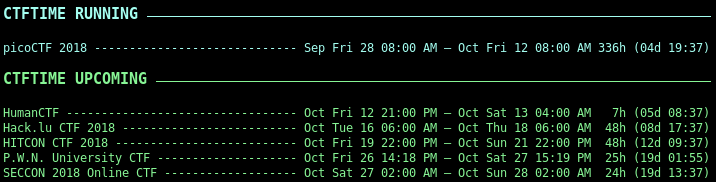

# ascope-conky-ctftime

This repository contains a conky script to gather the latest ctftime.org upcoming, running and archive events. By default, it sets to list the Capture The Flag (CTFs) event 2 weeks before the current time and 3 weeks after it, but it can be tweaked within the ctftime.sh script, see the variables [`N_BEFORE_WEEK`](https://github.com/Ascope-Team/ascope-conky-ctftime/blob/master/ctftime.sh#L26) or [`N_AFTER_WEEK`](https://github.com/Ascope-Team/ascope-conky-ctftime/blob/master/ctftime.sh#L27).

```text
Requirement: conky
```

If you have any suggestions or improvement about the script, file an [issue](https://github.com/Ascope-Team/ascope-conky-ctftime/issues).

## Preview



## License
conky - GPL and BSD licenses  
ascope - same license as well for this project
